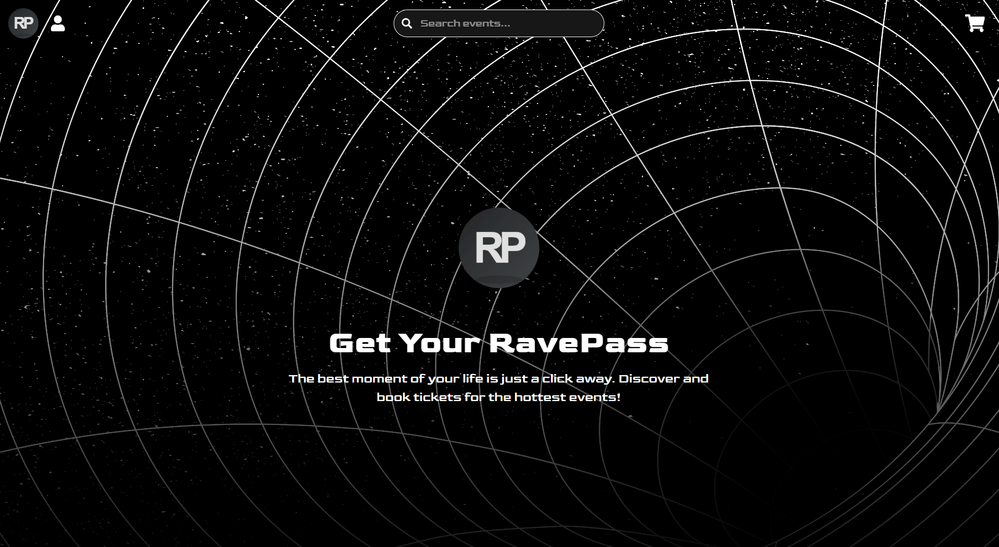

# EventTickets - Full-Stack Ticketing App

A full-stack MERN application featuring a complete and secure user authentication system. Built with TypeScript, this project serves as a robust foundation for a modern web application.


# Features

-Secure User Authentication:
-JWT-based login and session management.
-Password hashing using bcryptjs.
-Account activation via email verification with Nodemailer.
-Protected Routes: Both frontend pages (like /profile) and backend API endpoints are protected, redirecting unauthorized users.
-Centralized State Management: Uses Redux Toolkit for a predictable and scalable state container.
-RESTful API: A well-structured backend API built with Express.js and Mongoose.
-Type-Safe Code: Built with TypeScript for a more maintainable and robust codebase.

# Technology Stack

Frontend - React, TypeScript, Redux Toolkit, React Router, Axios, Tailwind CSS
Backend - Node.js, Express.js
Database - MongoDB, Mongoose
Authentication - JSON Web Tokens (JWT), bcryptjs
Tools - Nodemailer, Dotenv

# Running Locally

Follow these steps to get the project running on your local machine.

1. git clone https://github.com/Tsonkov7/eventTickets
   cd eventTickets

2. cd server
   npm install
   cd ../client
   npm install

3. server/.env
   PORT=3000
   MONGO_URI=your_mongodb_connection_string
   JWT_SECRET=your_super_secret_key
   EMAIL_USER=your_gmail_address
   EMAIL_PASS=your_16_character_gmail_app_password
   FRONTEND_URL=http://localhost:5173

4. Run the Application\*\*
   You'll need two separate terminals for this.

- **Start the Backend Server** (from the `/server` directory):
  ````bash
  nodemon index.js
  ```*   **Start the Frontend Client** (from the `/client` directory):
  ```bash
  npm run dev
  ````

The application will be available at `http://localhost:5173`.
